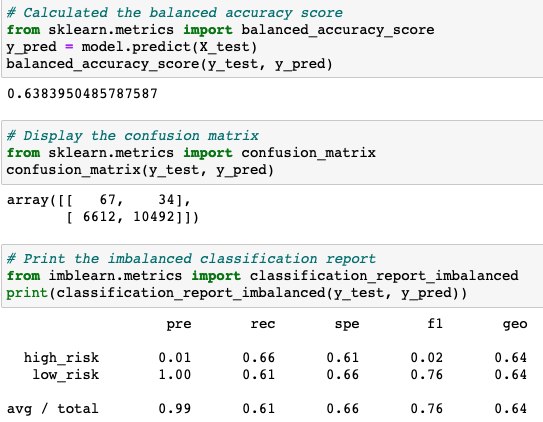
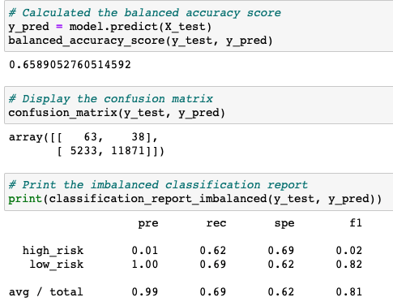
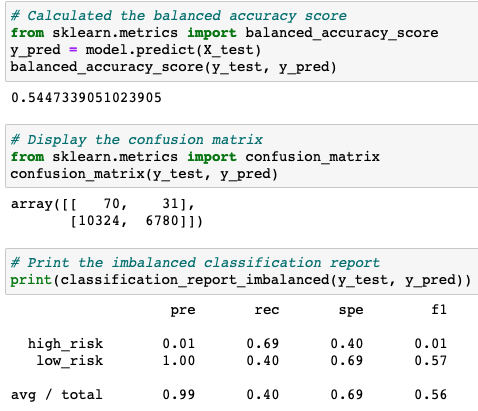
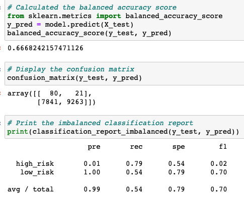
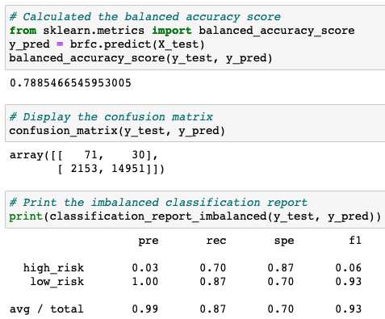
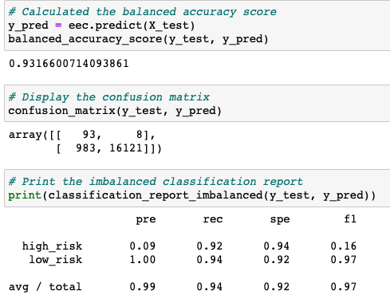

# Credit_Risk_Analysis
## Overview of the analysis
- The purpose of this project is to predict the credit risk by using the credit card credit dataset from LendingClub. Since good loans easily outnumber risky loans on credit risk data, I used different algorithms to predict the credit risk with unbalanced classes. 

## Results
- Naive Random Oversampling: The balanced accuracy score is 0.64, the precisions of high risk and low risk are 0.01 and 1.00 respectively, the recalls of high risk and low risk are 0.66 and 0.61 respectively.

- SMOTE Oversampling: The balanced accuracy score is 0.66, the precisions of high risk and low risk are 0.01 and 1.00 respectively, the recalls of high risk and low risk are 0.62 and 0.69 respectively.

- Undersampling: The balanced accuracy score is 0.54, the precisions of high risk and low risk are 0.01 and 1.00 respectively, the recalls of high risk and low risk are 0.69 and 0.40 respectively.

- Combination Sampling: The balanced accuracy score is 0.67, the precisions of high risk and low risk are 0.01 and 1.00 respectively, the recalls of high risk and low risk are 0.79 and 0.54 respectively.

- Balanced Random Forest Classifier: The balanced accuracy score is 0.79, the precisions of high risk and low risk are 0.03 and 1.00 respectively, the recalls of high risk and low risk are 0.70 and 0.87 respectively.

- Easy Ensemble AdaBoost Classifier: The balanced accuracy score is 0.93, the precisions of high risk and low risk are 0.09 and 1.00 respectively, the recalls of high risk and low risk are 0.92 and 0.94 respectively.

## Summary
- The balanced accuracy scores of all machine learning models except easy ensemble adaboost classifier vary from 0.54 to 0.79. The balanced accuracy score of easy ensemble adaboost classifier is 0.93, but this score can be misleading since the dataset is unbalanced. The precisions of high risk for all machine learning models are very low, which vary from 0.01 to 0.09. The precisions of low risk for all machine learning models are 1.0. The recalls of high risk and low risk for easy ensemble adaboost classifier are high, 0.92 and 0.94 respectively.
- I would not recommend any models because the precisions of high risk for all models are really low which indicate the high false positive rate. 
